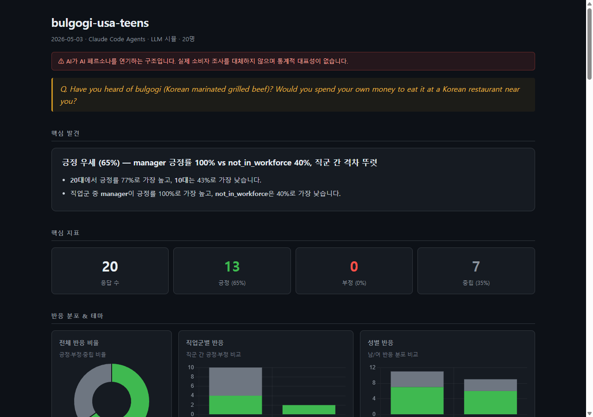

# market-simulation

**AI persona simulation via Claude Code — no local LLM or API key required.**

Runs batched market research, copy testing, content audits, and more against  
NVIDIA Nemotron-Personas (7 countries, 8M+ personas, CC BY 4.0).

> ⚠️ **This is LLM-playing-LLM-personas.** Results are hypotheses for early-stage validation,  
> not a substitute for real consumer research. Agreement rates skew high due to LLM positive bias.

---

## Quick start

**Requirements:** [Claude Code](https://claude.ai/code) · Python 3.10+

```bash
pip install market-simulation
market-simulation install-skill
```

Restart your Claude Code session — the skill loads automatically.

---

## Report preview



> Dark-mode HTML report — sentiment distribution, demographic cross-tabs, auto-generated insights, and full response cards.

---

## Example prompts

| Use case | Prompt |
|---|---|
| Market reaction | "Simulate how 20 Seoul office workers in their 30s react to a ₩9,900/mo coffee subscription" |
| Copy A/B test | "Which of these 2 taglines resonates more with women in their 20s–30s in Tokyo?" |
| Content clarity | "Would a high-school-educated 40-year-old find this terms-of-service hard to understand?" |
| Chatbot tone check | "Does this chatbot response feel natural to male users in their 50s?" |
| Policy / HR | "Compare reactions to a 4.5-day workweek across manufacturing, IT, and service workers" |
| Brand naming | "Which of these 3 brand names feels most trustworthy to self-employed people in their 30s?" |

---

## Supported countries

| country | Dataset | Language |
|---|---|---|
| `korea` | Nemotron-Personas-Korea | Korean |
| `usa` | Nemotron-Personas-USA | English |
| `japan` | Nemotron-Personas-Japan | Japanese |
| `india` | Nemotron-Personas-India | English / Hindi |
| `france` | Nemotron-Personas-France | French |
| `brazil` | Nemotron-Personas-Brazil | Portuguese |
| `singapore` | Nemotron-Personas-Singapore | English |

---

## How it works

```
HuggingFace streaming       Claude Code skill
(8M+ personas)   ──▶   filter target segment
                 ──▶   split into batches of 5
                 ──▶   run parallel sub-agents (isolated context per batch)
                 ──▶   collect responses → CSV + HTML report
```

- Streaming load — no full dataset download required
- Isolated batches — no cross-contamination between personas
- Output: `output/YYYY-MM-DD_{topic}.csv` + `.report.html`

---

## Simulation limits

| | Value |
|---|---|
| Default | 20 personas |
| Maximum | **30** (6 agents × 5) |

---

## Programmatic use

```python
from market_simulation import load_pool, filter_pool, occupation_kw

df = load_pool('usa', sample_n=50000)
pool = filter_pool(df, province='CA', age_range=(25, 39),
                   occupation_keywords=occupation_kw('tech'))
sample = pool.sample(20, random_state=42)
```

English occupation filters: `occupation_kw('tech')`, `occupation_kw('finance')`, `occupation_kw('healthcare')`, etc.

---

## Disclaimer

- Results are **LLM-generated hypotheses** — not survey or interview data.
- Use relative comparisons within a run. Absolute numbers (e.g. "65% positive") are inflated by LLM positive bias.
- Persona data: CC BY 4.0 (NVIDIA). Attribution required when publishing results.

---

## License

Code: MIT · Persona data: [CC BY 4.0](https://creativecommons.org/licenses/by/4.0/) (NVIDIA)
